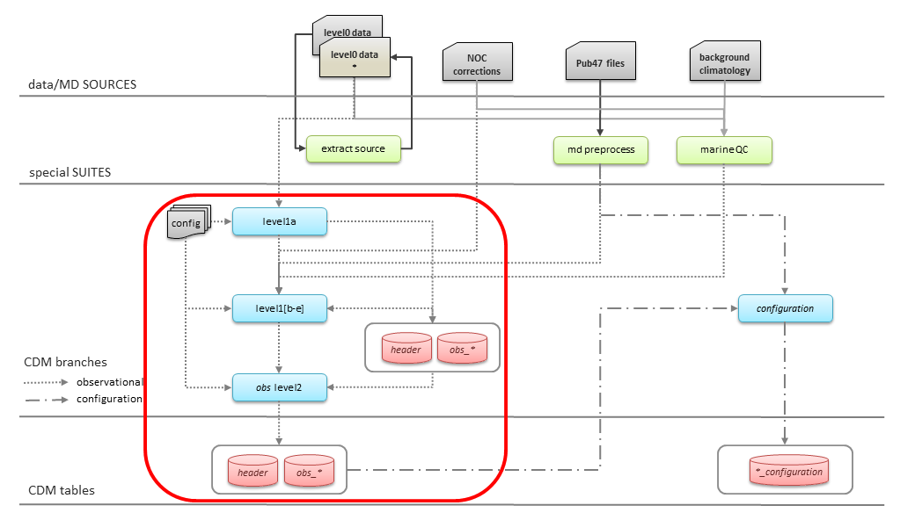

.. Marine observations suite documentation master file, created by
   sphinx-quickstart on Thu Jul 23 07:39:51 2020.
   You can adapt this file completely to your liking, but it should at least
   contain the root `toctree` directive.

Welcome to Marine observations suite's documentation
----------------------------------------------------

The Marine Observations Suite is part of the code implemented to produce the
data deliveries for the C3S Marine In Situ Component. Instructions to run the
full set of suites, including this one, are available in the C3S Technical
Service Document. The present manual includes the set of instructions needed to
run the observations suite, and also more detailed information on this branch of
the marine code.

The Observation Suite is a set of python and shell scripts to harmonize and
convert input observational data sources to CDM formatted files.

It is based on a set of chained processes, each step feeding into the next one
and with the initial dataset (previously prepared for inclusion in the marine
processing) transitioning through a series of levels from the first mapping to
the CDM in level1a to the final set of curated observational CDM compatible
files in level2 (header and observations-\*). Some levels are fed with data from
additional external datasets or with the output of dedicated suites that run
concurrently to the overall scheme (see figure below).

    General marine data flow. The Observations Suite is highlighted in the red box.

.. toctree::
   :maxdepth: 2
   :hidden:
   :caption: Contents:

   About <readme>
   tool-set-up
   file-system
   processing-level
   new-data-release
   pre-processing
   level1a
   post-processing
   level1b
   level1c
   level1d
   level1e
   level2
   contributing
   authors
   changes

About
-----

:Version: |tag| |release|

:Citation: |zenodo|

:License: |license|

|logo_c3s| |logo_noc| |logo_copernicus|

.. |release| image:: https://img.shields.io/github/v/release/glamod/glamod-marine-processing.svg
        :target: https://github.com/glamod/glamod-marine-processing/releases
        :alt: Release

.. |license| image:: https://img.shields.io/github/license/glamod/glamod-marine-processing.svg
        :target: https://github.com/glamod/glamod-marine-processing/blob/main/LICENSE
        :alt: License

.. |tag| image:: https://img.shields.io/github/v/tag/glamod/glamod-marine-processing.svg
        :target: https://github.com/glamod/glamod-marine-processing/tags
        :alt: Tag

.. |zenodo| image:: https://img.shields.io/badge/zenodo-package_or_version_not_found-red
        :target: https://zenodo.org/glamod-marine-processing
 	      :alt: DOI

.. |logo_c3s| image:: figures/logo_c3s-392x154.png
        :width: 25%
        :target: https://climate.copernicus.eu/

.. |logo_noc| image:: figures/LOGO_2024_-_NOC_1_COLOUR.png
        :width: 10%
        :target: ttps://noc.ac.uk/

.. |logo_copernicus| image:: figures/copernicus.png
        :width: 25%
        :target: https://www.copernicus.eu/en
