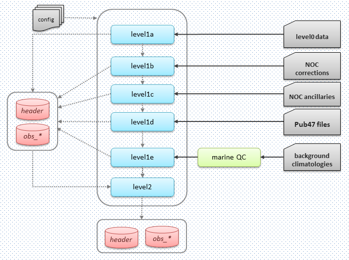

.. Marine observations suite documentation master file, created by
   sphinx-quickstart on Thu Jul 23 07:39:51 2020.
   You can adapt this file completely to your liking, but it should at least
   contain the root `toctree` directive.

Processing levels
=================

As shown in the diagram below, the Observations Suite is a set of chained
processes in which the source dataset transitions through the following levels:

    Observations Suite processing levels

* level1a: is the first mapping of the dataset to the CDM. Prior to mapping,
  the input data files are validated against the schema / data model and code
  tables defining the input. Reports failing this validation are discarded. For
  ICOADS, this includes also the rescue of any additional information from the
  supplemental attachment that has been identified as adding value. At this
  level the data are partitioned by date (monthly files), source and card
  deck information and observed parameter. For each month a set of files is
  created containing the header and observation tables (header and
  observations-[at|sst|dpt|wbt|slp|ws|wd]).
* level1b: is the data improved with corrections and/or additional information
  resulting from the linkage and duplicate identification process. Reassignment of
  reports to different monthly files can result from this process after datetime
  corrections. Therefore, *NOC corrections* are used. If no *NOC corrections* are
  available, Optionally, a duplicate check can be applied on the data.
* level1c: is the data with metadata (currently primary station identification
  and datetime) validation performed and applied where available.
  Therefore, *NOC ancillaries* are used.
* level1d: data is enriched with external meta-data where available. For ship
  data the additional meta data source is WMO Publication 47 metadata (*Pub47 files*).
* level1e: quality control flags are added at this level, resulting from
  the position, parameter and tracking quality control processes.
* level2: data ready to ingest in the database. Data in level1e is inspected as
  data filtering might apply and part of the initial data set might be rejected
  to be inserted in the CDS database.
