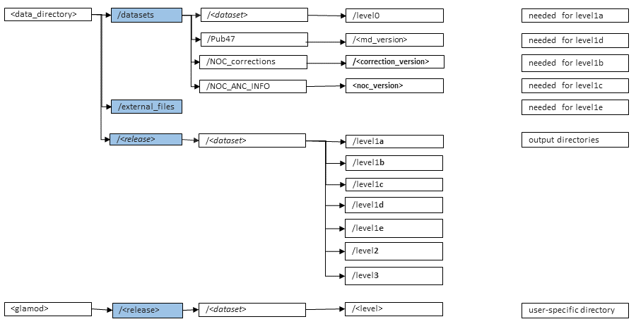

.. Marine observations suite documentation master file, created by
   sphinx-quickstart on Thu Jul 23 07:39:51 2020.
   You can adapt this file completely to your liking, but it should at least
   contain the root `toctree` directive.

Welcome to Marine observations suite's documentation!
=====================================================

.. toctree::
   :maxdepth: 3
   :caption: Contents:

Indices and tables
==================

* :ref:`genindex`
* :ref:`modindex`
* :ref:`search`

Introduction
============

The Marine Observations Suite is part of the code implemented to produce the
data deliveries for the C3S Marine In Situ Component. Instructions to run the
full set of suites, including this one, are available in the C3S Technical
Service Document. The present manual includes the set of instructions needed to
run the observations suite, and also more detailed information on this branch of
the marine code.

The Observation Suite is a set of python and shell scripts to harmonize and
convert input observational data sources to CDM formatted files. This includes
merging the CDM files with the output from the metadata and qc suites.

It is based on a set of chained processes, each step feeding into the next one
and with the initial dataset (previously prepared for inclusion in the marine
processing) transitioning through a series of levels from the first mapping to
the CDM in level1a to the final set of curated observational CDM compatible
files in level2 (header and observations-\*). Some levels are fed with data from
additional external datasets or with the output of dedicated suites that run
concurrently to the overall scheme (see figure below).

.. figure:: ../figures/marine_data_flow.png
    :width: 600px
    :align: center
    :alt: alternate text
    :figclass: align-center

    General marine data flow. The Observations Suite is highlighted in the red box.

.. _versions:

Note on versions
----------------

This manual was written at the time of transition between glamod-marine-processing
v1.1 and its migration to the SLURM scheduler.

Consequently, this manual describes the Observations Suite as available in the
HEAD of the repository (hence v1.1+), not in the last tagged version at that
time (v1.1).

Processing levels
=================

As shown in the diagram below, the Observations Suite is a set of chained
processes in which the source dataset transitions through the following levels:

.. figure:: ../figures/obs_suite_levels.png
    :width: 500px
    :align: center
    :alt: alternate text
    :figclass: align-center

    Observations Suite processing levels

* level1a: is the first mapping of the dataset to the CDM. Prior to mapping,
  the input data files are validated against the schema / data model and code
  tables defining the input. Reports failing this validation are discarded. For
  ICOADS, this includes also the rescue of any additional information from the
  supplemental attachment that has been identified as adding value. At this
  level the data are partitioned by date (monthly files), ICOADS source and card
  deck information and observed parameter. For each month a set of files is
  created containing the header and observation tables (header and
  observations-[at|sst|dpt|wbt|slp|ws|wd]).
* level1b: is the data improved with corrections and/or additional information
  resulting from the linkage and duplicate identification process. Reassignment of
  reports to different monthly files can result from this process after datetime
  corrections.
* level1c: is the data with metadata (currently primary station identification
  and datetime) validation performed and applied.
* level1d: data is enriched with external meta-data where available. For ship
  data the additional meta data source is WMO Publication 47 metadata.
* level1e: final quality control flags are added at this level, resulting from
  the position, parameter and tracking quality control processes.
* level2: data ready to ingest in the database. Data in level1e is inspected as
  data filtering might apply and part of the initial data set might be rejected
  to be inserted in the CDS database.

Marine file system
==================

The Observations Suite code is integrated in the file system designed for the
C3S data deliveries. The general directory structure that holds this file system
is shown in the figure.

    General marine directory structure

Tool set-up
===========

Code repository
---------------

The full set of suites that make up the marine code are integrated in the
glamod-marine-processing repository. Thus, to install the observations suite,
the repository needs to be cloned:

.. code-block:: bash

  git clone git@git.noc.ac.uk:iregon/glamod-marine-processing.git --branch version

where:

* version: see repository tags. Last tagged version is v1.1, with this manual
  currently describing the HEAD of the repository (See :ref:`versions`).

Setting paths and environments
------------------------------

Script obs-suite/setpaths.sh sets the paths for the processing software and data
files, including a scratch directory for the user running the software. Edit the
script file and set the environment variables as indicated below:

* code_directory: full path to the obs-suite code.
* home_directory_smf: full path to the obs-suite configuration.
* data_directory: full path to marine data file system.
* scratch_directory: this is system dependent and is currently set as available in CEDA-JASMIN

The obs-suite/setenv0.sh script initialises the processing environment. It needs
to be edited and the pyEnvironment_directory environmental variable set to the
path of the corresponding python environment installation (obs-suite/pyenvs/env0).
It also needs to be modified to include the path to the system python libraries
in the LD_LIBRARY_PATH variable.

Once the these scripts have been modified, the python virtual environment needs
to be initialised with the following block of code:

.. code-block:: bash

  cd obs-suite/env
  module load jaspy/3.7
  virtualenv -–system-site-packages env0
  source env0/bin/activate
  pip install -r requirements_env0.txt

Adding modules
--------------

Four additional python modules have been developed for this suite. The table
below lists these modules and which versions are compatible with the current
marine code version (v1.1 and HEAD).

.. list-table:: Title
   :widths: 30 30 55 10
   :header-rows: 1

   * - module
     - module_local
     - module_repo_url
     - version
   * - CDM mapper
     - cdm
     - git@git.noc.ac.uk:iregon/cdm-mapper.git
     - v1.2
   * - Data reader
     - mdf_reader
     - git@git.noc.ac.uk:iregon/mdf_reader.git
     - v1.2
   * - Metadata fixes
     - metmetpy
     - git@git.noc.ac.uk:iregon/metmetpy.git
     - v1.0
   * - Pandas operations
     - pandas_operations
     - git@git.noc.ac.uk:iregon/pandas_operations.git
     - v1.2

For each module listed the following needs to be run:

.. code-block:: bash

  cd obs-suite/modules/python
  git clone module_repo_url --branch version --single-branch module_local

Common paths
============

The following path names are used throughout this manual:

* *obs-suite*: path of the observations suite in the marine processing repository
* *config_directory*: path to the obs-suite directory in the configuration repository
* *data_directory*: path to general data directory in the marine file system
* *release_config_dir*: full path to the configuration of a specific data release
  within *config_directory*

Initializing a new data release
===============================

Configuration repository
------------------------

The glamod-marine-config repository
(git@git.noc.ac.uk:iregon/glamod-marine-config.git) serves as container for the
configuration used to create the different data releases for C3S. The
Observations Suite configuration files are stored in
obs-suite/*release*-*update*/*dataset* directories within this repository.

Currently, the following configuration sets are available:

.. list-table:: Title
   :widths: 20 30 10
   :header-rows: 1

   * - Data release
     - Path in repo/obs-suite
     - Marine code version
   * - r092019
     - r092019-000000/ICOADS_R3.0.0T
     - v1.0
   * - release_2.0
     - release_2.0-000000/ICOADS_R3.0.0T
     - v1.1
   * - Demo release
     - release_demo-000000/ICOADS_R3.0.0T
     - v1.1+ (HEAD)

Up until v1.1 (release_2.0), the configuration files were not maintained in
the configuration repository, but in the code repository. They have been now
included in the configuration repository for traceability. It is also worth
noting, that some changes have been made to the configuration files after v1.1:
the format in the Demo release files must be applied when running the observations
suite.

Create the configuration files for the release and dataset
----------------------------------------------------------

Every data release is identified in the file system with the following tags:

* release: release name (eg. release_2.0)
* update: update tag (eg. 000000)
* dataset: dataset name (eg. ICOADS_R3.0.0T)

Create a new directory *release*-*update*/*dataset*/ in the obs-suite
configuration directory (*config_directory*) of the configuration repository
(note the hyphen as field separator between *release* and *update*). We will now
refer to this directory as *release_config_dir*.

The files described in the following sections need to be created, with the
:ref:`release_periods_file` and the :ref:`process_list_file` required from the
setup of the new data release. The rest of the files can be generated as the
processing gets to the corresponding level.

The sample files in the following sections can be found in the release_demo
directory of the configuration repository.

.. _release_periods_file:

Release periods file
^^^^^^^^^^^^^^^^^^^^

Create file *release_config_dir*/source_deck_periods.json

This file is a json file with each of the source-deck partitions to be included
in the release, and the associated periods (year resolution) to process.

The figure below shows a sample of this file:

.. literalinclude:: ../config_files/source_deck_periods.json

.. _process_list_file:

Process list file
^^^^^^^^^^^^^^^^^

Create file *release_config_dir*/source_deck_list.txt

This is a simple ascii file with the list of source-deck partitions to process.
Create the master list with the keys of file source_deck_periods.json. This file
can later be subsetted if a given process is to be run in batches.

The figure below shows a sample of this file:

.. literalinclude:: ../config_files/source_deck_list.txt

.. _level1a_config_file:

Level 1a configuration file
^^^^^^^^^^^^^^^^^^^^^^^^^^^

Create file *release_config_dir*/level1a.json.

This file includes information on the initial dataset files data model(s),
filters used to select reports and mapping to apply convert the data to the CDM.

The figure below shows a sample of this file:

.. literalinclude:: ../config_files/level1a.json

This file has its default configuration parameters in the outer keys.
Source-deck specific configuration can be applied by specifying a configuration
parameter under a *sid-dck* key. In the sample given, all the
source and decks will be processed with the default configuration, but 063-714,
that will use its own parameters.

Configuration parameters job* are only used by the slurm launchers, while the
rest by the corresponding level1a.py script.

.. _level1b_config_file:

Level 1b configuration file
^^^^^^^^^^^^^^^^^^^^^^^^^^^

Create file *release_config_dir*/level1b.json.

This file contains information on
the NOC corrections version to be used and the correspondences between the
CDM tables fields on which the corrections are applied and the subdirectories
where these corrections can be found. The CDM history stamp for every correction
is also configured in this file.

The figure below shows a sample of this file:

.. literalinclude:: ../config_files/level1b.json

This file has its default configuration parameters in the outer keys.
Source-deck specific configuration can be applied by specifying a configuration
parameter under a *sid-dck* key. In the sample above, only the default
configuration is applied.

Configuration parameters job* are only used by the slurm launchers, while the
rest by the corresponding level1b.py script.

.. _level1c_config_file:

Level 1c configuration file
^^^^^^^^^^^^^^^^^^^^^^^^^^^

Create file *release_config_dir*/level1c.json.

The only configuration parameters
required in this file are those related to the slurm launchers, as the rest of
the configuration of this process is basically hardcoded in the level1c.py
script.

The figure below shows a sample of this file:

.. literalinclude:: ../config_files/level1c.json

This file has its default configuration parameters in the outer keys.
Source-deck specific configuration can be applied by specifying a configuration
parameter under a *sid-dck* key. In the sample above, only the default
configuration is applied.

.. _level1d_config_file:

Level 1d configuration file
^^^^^^^^^^^^^^^^^^^^^^^^^^^

Create file *release_config_dir*/level1d.json.

This file contains information
on the metadata sources that are merged into the level1c data. Currently the
only MD source is wmo_publication_47 and the full process is basically tailored
to Pub47 as pre-processed in NOC.

This file contains information of the subdirectory in the release data directory
where the metadata can be found ("md_subdir") and the name of the mapping within the
Common Data Model mapper module used to map pub47 to the CDM ("md_model").

The level1d process will fail if it doesn't find a metadata file for a month
partition. To account for periods where metadata are not available, the
following optional keys can be used:

* "md_not_avail": true indicates the process that for the full release period,
  there is not metadata available. Defaults to false.
* "md_first_yr_avail": indicates the first year for which metadata files should
  be available in the release period. Defaults to first year in the release
  period.
* "md_last_yr_avail": indicates the last year for which metadata files should be
  available in the release period. Defaults to last year in the release
  period.

By using the above keys, the process is indicated to securely progress data files
to the next processing level without merging any metadata when it is not available.

The figure below shows a sample of this file:

.. literalinclude:: ../config_files/level1d.json

This file has its default configuration parameters in the outer keys.
Source-deck specific configuration can be applied by specifying a configuration
parameter under a *sid-dck* key. In the sample above, only the default
configuration is applied.

.. _level1e_config_file:

Level 1e configuration file
^^^^^^^^^^^^^^^^^^^^^^^^^^^

Create file *release_config_dir*/level1e.json.

The level1e specific parameters included in this file are:

* "qc_first_date_avail" : first monthly quality control file the process can
  expect to find. If the data files to process are prior to this date, then
  the data files will progress to the next level without quality flag merging
  and without raising an error.
* "qc_last_date_avail" : last monthly quality control file the process can
  expect to find. If the data files to process are later to this date, then
  the data files will progress to the next level without quality flag merging
  and without raising an error.
* "history_explain" : text added to the header file history field when flags are
  merged.

The figure below shows a sample of this file:

.. literalinclude:: ../config_files/level1e.json

This file has its default configuration parameters in the outer keys.
Source-deck specific configuration can be applied by specifying a configuration
parameter under a *sid-dck* key. In the sample above, only the default
configuration is applied.

Set up the release data directory
---------------------------------

Every new release or new dataset in a release needs to have its corresponding
directory structure initialised in the file system:

.. code-block:: bash

  cd obs-suite
  source setpaths.sh
  source setenv0.sh
  cd scripts
  python make_release_source_tree.py $data_directory $config_directory release update dataset

where:

* release: release identifier in file system
* update: release update identifier in file system
* dataset: dataset identifier in file system

This script does not overwrite existing directories and is safe to run on an
existing directory structure if new source-decks have to be added.

Level 1a
========

Level 1a contains the initial data converted from the input data sources
(level0) to files compatible with the CDM.

Every monthly file of the individual source-deck ICOADS dataset partitions is
converted with the following command:

.. code:: bash

  cd obs-suite
  source setpaths.sh
  source setenv0.sh
  cd scripts
  python level1a.py $data_directory release update dataset level1a_config sid-dck year month

where:

* release: release identifier in file system
* update: release update identifier in file system
* dataset: dataset identifier in file system
* level1a_config: path to the level1a configuration file ( :ref:`level1a_config_file`)
* sid-dck: source-deck identifier
* year: file year, format yyyy
* month: file month, format mm

To facilitate the processing of a large number of files level1a.py can be run
in batch mode:

.. code:: bash

  cd obs-suite
  source setpaths.sh
  source setenv0.sh
  cd lotus_scripts
  python level1a_slurm.py release update dataset $config_directory process_list --failed_only yes|no

where:

* release: release identifier in file system
* update: release update identifier in file system
* dataset: dataset identifier in file system
* process_list: full path to file with the list of source-deck partitions to
  process. This file can be either :ref:`process_list_file` or a subset of it.
* failed_only: optional (yes|no). Defaults to no. Setting this argument to 'yes'
  means that only the monthly files with a \*.failed log file will be processed.

This script executes an array of monthly subjobs per source and deck included in
the process_list. The configuration for the process is directly accessed from
the release configuration directory: the data period processed is as configured
per source and deck in the release periods file ( :ref:`release_periods_file`)
and the level1a configuration is retrieved from :ref:`level1a_config_file`.

This script logs to *data_dir*/release/dataset/level1a/log/sid-dck/. Log files
are yyyy-mm-<release>-<update>.ext with ext either ok or failed depending on the
subjob termination status.

List  \*.failed in the sid-dck level1a log directories to find if any went wrong.

Level 1b
========

Level 1b integrates external files containing enhanced information on the
duplicate status of the observations, corrected date/time and locations, and
linked station IDs with the level1a data. As part of the integration a weather
report may move between months if an error in the date had previously been
identified and the correct data is for a different month. A description of the
processing used to generate these external files is described in the marine
duplication identification document (available upon request,
to be published shortly). It should be noted that this processing is currently
external to C3S311a_lot2 but will be integrated in a future release.

The external files need to be copied to the datasets directory in the marine
data directory prior to processing (datasets/NOC_corrections/*cor_version*).
Once copied to the required directory structure the files need to be reformatted
for integration with the level1a files. This is processing is done via python
and shell scripts using the SLURM scheduler. The following block needs to be run
once for each of the options id, datepos or duplicates:

.. code:: bash

  cd obs-suite
  source setpaths.sh
  source setenv0.sh
  cd scripts
  option=option
  sbatch -J $option -o $option.out -e $option.out -p short-serial -t 03:00:00 --mem 1000 --open-mode truncate --wrap="./noc_corrections_postprocess.sh release cor_version $option year_init year_end"

where:

* release: release tag
* option: id, datepos or duplicates
* cor_version: NOC correction version (v1x2019 for release 1 and release 2)
* year_init|end: first|last year of data release.

This step places the reformatted correction files in the release directory in
the marine data directory (*release*/NOC_corrections/*cor_version*) ready to be
merged with the CDM data files. The time needed will depend on the period
pre-processed. However if the job terminates due to insufficient time allocation,
the period remaining to be pre-processed can be launched independently, and it
will not affect the files already processed.

The reformatted files are merged with the level1a data by the following command:

.. code:: bash

  cd obs-suite
  source setpaths.sh
  source setenv0.sh
  cd scripts
  python level1b.py $data_directory release update dataset level1b_config sid-dck year month

where:

* release: release identifier in file system
* update: release update identifier in file system
* dataset: dataset identifier in file system
* level1b_config: path to the level1b configuration file ( :ref:`level1b_config_file`)
* sid-dck: source-deck identifier
* year: file year, format yyyy
* month: file month, format mm

To facilitate the processing of a large number of files level1b.py can be run
in batch mode:

.. code:: bash

  cd obs-suite
  source setpaths.sh
  source setenv0.sh
  cd lotus_scripts
  python level1b_slurm.py release update dataset $config_directory process_list --failed_only yes|no

where:

* release: release identifier in file system
* update: release update identifier in file system
* dataset: dataset identifier in file system
* process_list: full path to file with the list of source-deck partitions to
  process. This file can be either :ref:`process_list_file` or a subset of it.
* failed_only: optional (yes|no). Defaults to no. Setting this argument to 'yes'
  means that only the monthly files with a \*.failed log file will be processed.

This script executes an array of monthly subjobs per source and deck included in
the process_list. The configuration for the process is directly accessed from
the release configuration directory: the data period processed is as configured
per source and deck in the release periods file ( :ref:`release_periods_file`)
and the level1b configuration is retrieved from :ref:`level1b_config_file`.

This script logs to *data_dir*/release/dataset/level1b/log/sid-dck/. Log files
are yyyy-mm-<release>-<update>.ext with ext either ok or failed depending on the
subjob termination status.

List  \*.failed in the sid-dck level1b log directories to find if any went wrong.

Level 1c
========

Level1c files contain reports from level1b that have been further validated
following corrections to the date/time, location and station ID. Those failing
validation are rejected and archived for future analysis. Additionally, datetime
corrections applied previously in level1b, can potentially result in reports
being relocated to a different month. These reports are moved to their correct
monthly file in this level.

To generate level1c files, the individual sid-dck monthly files in level1b are
processed with:

.. code:: bash

  cd obs-suite
  source setpaths.sh
  source setenv0.sh
  cd scripts
  python level1c.py $data_directory release update dataset level1c_config sid-dck year month

where:

* release: release identifier in file system
* update: release update identifier in file system
* dataset: dataset identifier in file system
* level1c_config: path to the level1c configuration file ( :ref:`level1c_config_file`)
* sid-dck: source-deck identifier
* year: file year, format yyyy
* month: file month, format mm

To facilitate the processing of a large number of files level1c.py can be run
in batch mode:

.. code:: bash

  cd obs-suite
  source setpaths.sh
  source setenv0.sh
  cd lotus_scripts
  python level1c_slurm.py release update dataset $config_directory process_list --failed_only yes|no --remove_source yes|no

where:

* release: release identifier in file system
* update: release update identifier in file system
* dataset: dataset identifier in file system
* process_list: full path to file with the list of source-deck partitions to
  process. This file can be either :ref:`process_list_file` or a subset of it.
* failed_only: optional (yes|no). Defaults to no. Setting this argument to 'yes'
  means that only the monthly files with a \*.failed log file will be processed.
* remove_source: optional (yes|no). Defaults to no. Setting this argument to 'yes'
  implies removal of the source level (level1b) data files if the full set of
  monthly data files of a given source-deck is successfully processed.

This script executes an array of monthly subjobs per source and deck included in
the process_list. The configuration for the process is directly accessed from
the release configuration directory: the data period processed is as configured
per source and deck in the release periods file ( :ref:`release_periods_file`)
and the level1c configuration is retrieved from :ref:`level1c_config_file`.

This script logs to *data_dir*/release/dataset/level1c/log/sid-dck/. Log files
are yyyy-mm-<release>-<update>.ext with ext either ok or failed depending on the
subjob termination status.

List  \*.failed in the sid-dck level1c log directories to find if any went wrong.

Level 1d
========

The level1d files contain the level1c data merged with external metadata (where
available). In the current marine processing implementation, the level1c are
merged with WMO Publication 47 metadata to set instrument heights, station names
and platform sub types (i.e. type of ship). Prior to merging, the WMO
Publication 47 metadata are harmonised, quality controlled and pre-processed in
a process that run independently to this data flow (add ref). After
pre-processing, this info needs to be made available to the release in directory
*data_directory*/*release*/wmo_publication_47/monthly/.

To generate level1d files, the individual sid-dck monthly files in level1c are
processed with:

.. code:: bash

  cd obs-suite
  source setpaths.sh
  source setenv0.sh
  cd scripts
  python level1d.py $data_directory release update dataset level1d_config sid-dck year month

where:

* release: release identifier in file system
* update: release update identifier in file system
* dataset: dataset identifier in file system
* level1d_config: path to the level1d configuration file ( :ref:`level1d_config_file`)
* sid-dck: source-deck identifier
* year: file year, format yyyy
* month: file month, format mm

To facilitate the processing of a large number of files level1d.py can be run
in batch mode:

.. code:: bash

  cd obs-suite
  source setpaths.sh
  source setenv0.sh
  cd lotus_scripts
  python level1d_slurm.py release update dataset $config_directory process_list --failed_only yes|no --remove_source yes|no

where:

* release: release identifier in file system
* update: release update identifier in file system
* dataset: dataset identifier in file system
* process_list: full path to file with the list of source-deck partitions to
  process. This file can be either :ref:`process_list_file` or a subset of it.
* failed_only: optional (yes|no). Defaults to no. Setting this argument to 'yes'
  means that only the monthly files with a \*.failed log file will be processed.
* remove_source: optional (yes|no). Defaults to no. Setting this argument to 'yes'
  implies removal of the source level (level1c) data files if the full set of
  monthly data files of a given source-deck is successfully processed.

This script executes an array of monthly subjobs per source and deck included in
the process_list. The configuration for the process is directly accessed from
the release configuration directory: the data period processed is as configured
per source and deck in the release periods file ( :ref:`release_periods_file`)
and the level1d configuration is retrieved from :ref:`level1d_config_file`.

This script logs to *data_dir*/release/dataset/level1d/log/sid-dck/. Log files
are yyyy-mm-<release>-<update>.ext with ext either ok or failed depending on the
subjob termination status.

List  \*.failed in the sid-dck level1d log directories to find if any went wrong.

Level 1e
========

The level1e processing merges the data quality flags from the Met Office QC
suite (add ref) with the data from level 1d. The QC software generates two sets
of QC files, one basic QC of the observations from all platforms and an enhanced
track and quality check for drifting buoy data. The basic QC flags are stored in
*data_directory*/*release*/*dataset*/metoffice_qc/base/ and merged with the
following script:

.. code:: bash

  cd obs-suite
  source setpaths.sh
  source setenv0.sh
  cd scripts
  python level1e.py $data_directory release update dataset level1e_config sid-dck year month

where:

* release: release identifier in file system
* update: release update identifier in file system
* dataset: dataset identifier in file system
* level1e_config: path to the level1e configuration file ( :ref:`level1e_config_file`)
* sid-dck: source-deck identifier
* year: file year, format yyyy
* month: file month, format mm

To facilitate the processing of a large number of files level1e.py can be run
in batch mode:

.. code:: bash

  cd obs-suite
  source setpaths.sh
  source setenv0.sh
  cd lotus_scripts
  python level1e_slurm.py release update dataset $config_directory process_list --failed_only yes|no --remove_source yes|no

where:

* release: release identifier in file system
* update: release update identifier in file system
* dataset: dataset identifier in file system
* process_list: full path to file with the list of source-deck partitions to
  process. This file can be either :ref:`process_list_file` or a subset of it.
* failed_only: optional (yes|no). Defaults to no. Setting this argument to 'yes'
  means that only the monthly files with a \*.failed log file will be processed.
* remove_source: optional (yes|no). Defaults to no. Setting this argument to 'yes'
  implies removal of the source level (level1d) data files if the full set of
  monthly data files of a given source-deck is successfully processed.

This script executes an array of monthly subjobs per source and deck included in
the process_list. The configuration for the process is directly accessed from
the release configuration directory: the data period processed is as configured
per source and deck in the release periods file ( :ref:`release_periods_file`)
and the level1d configuration is retrieved from :ref:`level1e_config_file`.

This script logs to *data_dir*/release/dataset/level1e/log/sid-dck/. Log files
are yyyy-mm-<release>-<update>.ext with ext either ok or failed depending on the
subjob termination status.

List  \*.failed in the sid-dck level1e log directories to find if any went wrong.

After the basic QC flags have been merged the enhanced drifting buoy flags need
to be merged with the level1e data. This process is described under Quality
control in 4.4.6 in the C3S Technical Service Document (but will be moved to the level1e
processing in a future update).

Once the drifting buoy flags have been merged the data files will no longer
change and summary data reports need to be generated prior to the data moving to
level2. See documentation in git@git.noc.ac.uk:iregon/marine-user-guide.git to
create the reports.

Level 2
========

After visual inspection of the reports generated in level1e, only observation
tables reaching a minimum quality standard proceed to level2: this might imply
rejecting a full sid-dck dataset or an observational table or change the period
of data to release. The level1e data composition that has been used to generate
the level2 product of every release is configured in level2.json file available
in the release configuration directory. Prior to first use this file needs to be
created. This can be done using the following commands:

.. code:: bash

  cd obs-suite
  source setpaths.sh
  source setenv0.sh
  cd scripts
  python level2_config.py release_period_file year_ini year_end

where:

* release_periods_file: full path to the release periods file ( :ref:`release_periods_file` )
* year_ini: first year in data release period.
* year_end: last year in data release period.

This script creates the selection file level2.json in the execution directory.
The parameters year_init and year_end are used to set the final period of data
release, that might be different to that initially processed. The data period of
each of the individual source-deck data partitions is adjusted in the level2.json
file according to these arguments.

After checking data quality on the level1e
reports, edit the data selection file as needed to create the final dataset
composition:

*	Remove a full sid-dck from level2 by setting to true the sid-dck ‘exclude’ tag.
*	Remove an observation table from the full dataset by adding it to the list under the general ‘params_exclude’ tag.
*	Remove an observation table from a sid-dck by adding it to the list under the sid-dck ‘params_exclude’ tag.
*	Adjust the release period of a sid-dck by modifying the ‘year_init|end’ tags of the sid-dck
*	Observation tables to be removed have to be named as observations-[at|sst|dpt|wbt|wd|ws|slp]
*	All edits need to be consistent with JSON formatting rules.

Once file level2.json has been edited the file needs to be copied to its
directory in the configuration repository to be version controlled.

In the file sample below, all observations-wbt table files will be retained for
level2, while observations-at will be dropped from level2 only in source-deck
063-714.

.. literalinclude:: ../config_files/level2.json

The level 2 processing is then run using:

.. code:: bash

  cd obs-suite
  source setpaths.sh
  source setenv0.sh
  cd scripts
  python level2.py data_directory release update dataset level2_config sid-dck

where:

* release: release identifier in file system
* update: release update identifier in file system
* dataset: dataset identifier in file system
* level2_config: path to the level2 configuration file
* sid-dck: source-deck identifier

The launcher script for level2 is run with:

.. code:: bash

  cd obs-suite
  source setpaths.sh
  source setenv0.sh
  cd lotus_scripts
  python level2_slurm.py release update dataset $config_directory process_list

where:

* release: release identifier in file system
* update: release update identifier in file system
* dataset: dataset identifier in file system
* process_list: full path to file with the list of source-deck partitions to
  process. This file can be either :ref:`process_list_file` or a subset of it.

This script executes a job per source and deck included in the process_list.
The configuration file for the process (level2.json) is directly accessed from
the release configuration directory.

This script logs to *data_dir*/release/dataset/level2/log/sid-dck/. Log files
are *sid-dck*-*release*-*update*.ext with ext either ok or failed depending on the
subjob termination status.

List  \*.failed in the sid-dck level2 log directories to find if any went wrong.
